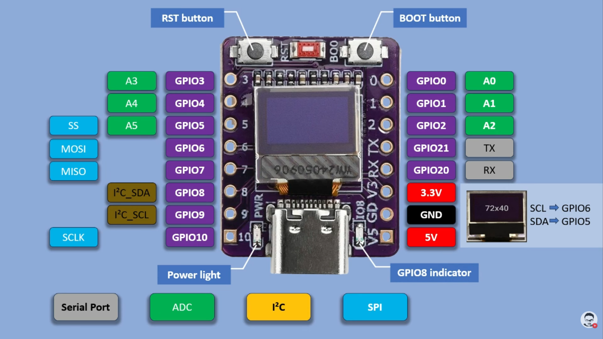

# ESP32-C3 Open Source Project

Kumpulan contoh program untuk ESP32-C3 dengan OLED 72x40 (I2C).

## Perangkat dan Lingkungan

- Board: ESP32-C3 (terintegrasi OLED 72x40)
- Framework yang dipakai di repo ini:
	- Arduino (untuk folder `JamSyncNTPViaWifi` dan `MenampilkanTextDiOled`)
	- ESP-IDF (untuk folder `BlinkLedGPI08`)
- Tools:
	- VS Code + ekstensi PlatformIO IDE, atau
	- PlatformIO CLI

## Schema Microcontroller



*Diagram koneksi ESP32-C3 terintegrasi dengan OLED 72x40 (I2C)*

## Struktur Project

- `BlinkLedGPI08`: contoh blink LED (ESP-IDF)
- `JamSyncNTPViaWifi`: jam NTP via WiFi tampil di OLED (Arduino)
- `MenampilkanTextDiOled`: tampilkan teks statis di OLED (Arduino)

## Cara Menjalankan (Umum)

Lakukan langkah berikut untuk setiap folder project yang ingin dijalankan:

1. Buka terminal pada folder project target (misalnya `JamSyncNTPViaWifi`).
2. Build project:

```bash
pio run
```

3. Upload ke board:

```bash
pio run -t upload
```

4. (Opsional) Buka serial monitor:

```bash
pio device monitor -b 115200
```

Jika port belum terdeteksi otomatis, tambahkan di `platformio.ini`:

```ini
upload_port = COMx
monitor_port = COMx
```

Ganti `COMx` sesuai port board Anda di Windows.

## Setting `config.h`

> **Penting:** File `config.h` tidak ikut di-commit ke Git (sudah ada di `.gitignore`).
> Template tersedia di `config.example.h`.

### 1) `JamSyncNTPViaWifi/src/config.h`

Salin template lalu isi kredensial:

```bash
cp src/config.example.h src/config.h
```

```c
#ifndef CONFIG_H
#define CONFIG_H

#define WIFI_SSID     "NAMA_WIFI_ANDA"
#define WIFI_PASSWORD "PASSWORD_WIFI_ANDA"

#endif
```

Catatan:
- Gunakan WiFi 2.4 GHz yang dapat diakses ESP32-C3.
- Program akan menampilkan status koneksi di OLED, lalu sinkron NTP.

### 2) `MenampilkanTextDiOled/src/config.h`

Edit teks yang ingin ditampilkan di OLED:

```c
#ifndef CONFIG_H
#define CONFIG_H

#define TextTampil "ANWAR"

#endif
```

Ganti nilai `TextTampil` sesuai kebutuhan, misalnya `"HELLO"`.

## Fitur `JamSyncNTPViaWifi`

OLED menampilkan dua halaman yang bergantian setiap **3 detik** dengan animasi scroll horizontal non-blocking:

| Halaman | Konten |
|---------|--------|
| 1 | Jam `HH:MM` (baris 1) dan detik `SS` (baris 2) |
| 2 | Teks nama (`HALLO` / sesuaikan di `drawHalloPage`) |

Karena animasi non-blocking, nilai detik tetap diperbarui secara real-time saat transisi berlangsung.

## Catatan OLED 72x40 pada ESP32-C3

Project ini menggunakan konfigurasi I2C:

- `SDA_PIN = 5`
- `SCL_PIN = 6`
- Driver display U8g2: `U8G2_SSD1306_72X40_ER_F_HW_I2C`

Pastikan board Anda memang memakai mapping pin tersebut. Jika berbeda, ubah definisi pin di file source masing-masing project Arduino.

## Menjalankan Tiap Contoh

### A. Blink LED (ESP-IDF)

Folder: `BlinkLedGPI08`

- LED diblink pada `GPIO_NUM_8`.
- Build/Upload gunakan perintah umum PlatformIO di atas.

### B. Jam NTP via WiFi + OLED

Folder: `JamSyncNTPViaWifi`

Langkah cepat:

1. Isi `src/config.h` (SSID dan password WiFi).
2. Upload ke board.
3. Tunggu proses koneksi WiFi dan sinkron waktu NTP.
4. Jam akan tampil di OLED.

### C. Menampilkan Teks di OLED

Folder: `MenampilkanTextDiOled`

Langkah cepat:

1. Ubah `TextTampil` di `src/config.h`.
2. Upload ke board.
3. Teks tampil pada OLED.

## Kontak

Untuk pertanyaan terkait project ini:

- Email: `nc.anwar[_at_]jaringankantor.com`
